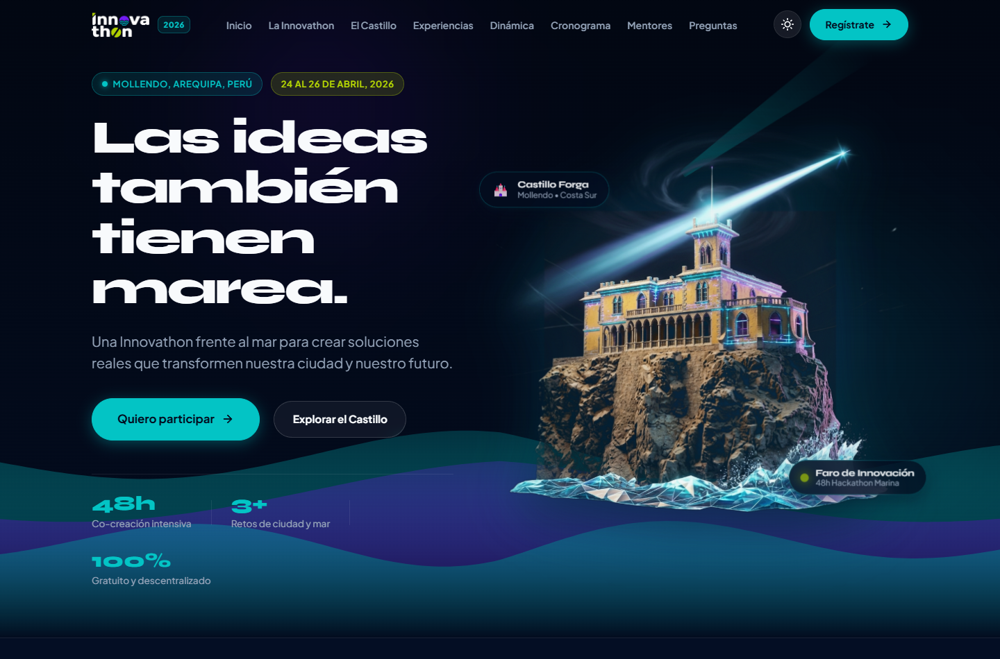
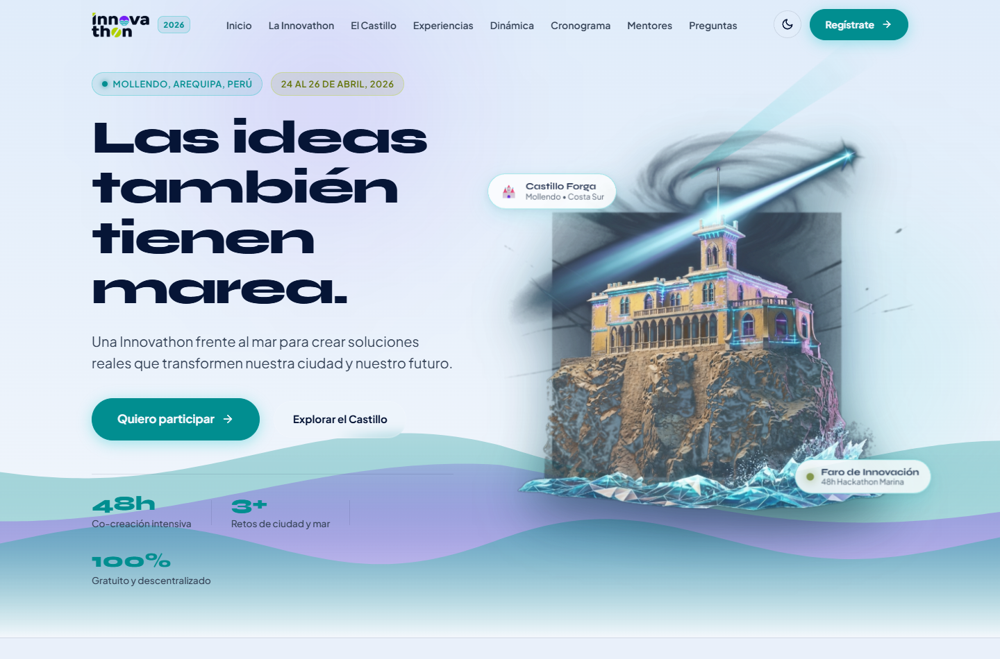

# 🌊 Mollethon — Innovathon Mollendo 2026
### *“Las ideas también tienen marea.”*

[](https://playwright.dev/)
[](https://brave.com/)
[](https://react.dev/)
[](https://vitejs.dev/)
[](https://opensource.org/licenses/ISC)

Este repositorio contiene la **plataforma web interactiva oficial para la Mollethon (Innovathon Mollendo 2026)**: un festival y hackathon tecnológica de **48 horas de co-creación intensiva frente al mar** en la ciudad de Mollendo, Arequipa (Perú).

El proyecto fue diseñado y desarrollado con una estética costera premium, integrando la identidad visual oficial del evento (`PROPUESTA BRANDKIT.pdf`), física marina en tiempo real, el emblemático **Castillo Forga en 3D** en el Hero y el soporte completo para **Modo Claro y Modo Oscuro**.

---

## 📸 Vista Previa del Hero Section

| Modo Oscuro (Deep Ocean Navy) | Modo Claro (Espuma Marina) |
| :---: | :---: |
|  |  |

---

## 🧭 ¿De qué trata la Mollethon / Innovathon?

La **Mollethon** es un movimiento que une la historia portuaria, el ecosistema marino y el talento del litoral arequipeño con la tecnología moderna:

- **Propósito:** Conectar a estudiantes, desarrolladores, diseñadores, científicos marinos y emprendedores para crear prototipos reales ante desafíos de sostenibilidad, turismo inteligente, economía azul y desarrollo cívico.
- **Formato:** 48 horas continuas de hackathon, masterclasses de especialistas, sesiones de mentoría 1:1, testing en vivo y Demo Day con pitch frente a un jurado de la industria.
- **Sede:** Circuito costero del Malecón Ratti y Estación Cultural de Mollendo, Arequipa.
- **Acceso:** 100% libre y gratuito para democratizar la tecnología en la región sur.

---

## ⚡ Experiencia Interactiva & Características de la Web

La plataforma fue concebida para no sentirse como una plantilla estática corporativa ni un dashboard genérico, sino como una **experiencia marina viva**:

1. **Selector de Modo Claro / Modo Oscuro ([tokens.css](src/styles/tokens.css) & [Navbar.jsx](src/components/Navbar.jsx))**:
   - Soporte nativo para tema claro (`data-theme="light"`) con paleta costera diurna, contraste accesible WCAG AA y adaptación automática de olas en el canvas.
   - **Switch dinámico de logotipo:** Emplea automáticamente `logo-dark.png` sobre fondos claros y `logo-light.png` en modo nocturno.
2. **El Castillo Forga Dinámico ([CastilloSection.jsx](src/sections/CastilloSection.jsx))**:
   - Espacio dedicado al ícono arquitectónico sobre los acantilados de Mollendo como faro de innovación.
   - **Hotspots de baliza marina:** Puntos interactivos con ondas de pulso sobre el castillo (*Torreón del Faro Digital*, *Acantilado del Pacífico*, *Baluarte Histórico Forga*).
   - **Telemetría Costera HUD:** Panel con mediciones de marea activa de Mollendo, temperatura del agua del Pacífico y fuerza del viento del sur.
3. **Simulador de Marea Oceánica en Tiempo Real ([OceanCanvas.jsx](src/components/OceanCanvas.jsx))**:
   - Canvas multicapa en el Hero con oleajes generados matemáticamente que se elevan, deforman y reaccionan dinámicamente a la posición del cursor.
4. **Puntero de Gota Marina con Física de Resorte ([CustomCursor.jsx](src/components/CustomCursor.jsx))**:
   - Cursor fluido que acompaña al usuario con inercia elástica, halo translúcido y transformación de escala (`scale(1.5)`) al interactuar con botones, tarjetas e inputs. Se desactiva automáticamente en pantallas táctiles y con `prefers-reduced-motion`.
5. **Tarjetas con Perspectiva 3D ([TiltCard.jsx](src/components/TiltCard.jsx))**:
   - Inclinación tridimensional suave y reflejo de luz que sigue la posición del puntero.
6. **Formulario de Inscripción Reactivo ([RegisterSection.jsx](src/sections/RegisterSection.jsx))**:
   - Validación instantánea con mensajes accesibles (`aria-describedby`), comprobación de email y celular de 9 dígitos.
   - **Campos condicionales:** Al seleccionar la modalidad *"En Equipo"*, despliega automáticamente el nombre del equipo y número de integrantes.
   - **Estados de interacción:** Focus con halo de agua marina, feedback de carga (*loading spinner*) y tarjeta de confirmación (*success state*) con pulso acuático y código único de registro (`MOL-XXXXXX`).
7. **Cronograma Dinámico por Días ([ScheduleSection.jsx](src/sections/ScheduleSection.jsx))**:
   - Navegación por pestañas (Viernes 24, Sábado 25, Domingo 26) con horarios, temáticas, badges de tipo y responsables.
8. **Línea de Tiempo de la Dinámica ([Timeline.jsx](src/components/Timeline.jsx))**:
   - 7 etapas del evento conectadas por un track oceánico continuo.
9. **Acordeón FAQ Accesible ([Accordion.jsx](src/components/Accordion.jsx))**:
   - Preguntas frecuentes con soporte completo para teclado y atributos `aria-expanded`.
10. **Pie de Página con Atardecer de Mollendo ([FooterSection.jsx](src/sections/FooterSection.jsx))**:
    - Atmósfera inspirada en el atardecer costero, enlaces a redes sociales y llamado final a la acción.

---

## 🎨 Identidad Oficial del Brandkit

La estética se sustenta estrictamente en la guía de marca oficial de la Innovathon:

| Elemento | Especificación | Uso en la Web |
| :--- | :--- | :--- |
| **Deep Ocean Navy** | `#030c1f` | Fondo principal y profundidad marina |
| **Marine Aqua / Cyan** | `#03c4c5` | Energía del mar, enlaces, cursor y acentos primarios |
| **Electric Violet** | `#741cf3` | Innovación tecnológica y hackathon |
| **Solar Lime** | `#b8da02` | Verano, juventud y botones de alta conversión |
| **Sunset Coral** | `#fc6c91` | Atardecer de Mollendo y estados de alerta |
| **Tipografía Display** | *Syne* / *Kief-Montaser* | Títulos principales de alto impacto |
| **Tipografía UI/Body** | *Plus Jakarta Sans* | Lectura cómoda y formularios |
| **Logotipo Oficial** | `MOL·LEN·DO` | Versiones clara y oscura extraídas del vector oficial |
| **5 Iconos de Marca** | Mar, Historia, Innovación, Colaboración, Impacto | Tarjetas de presentación y pilares de marca |

---

## 📁 Estructura del Código

```text
MOLLETHON/
├── src/
│   ├── components/          # Componentes de interacción y física
│   │   ├── Navbar.jsx       # Header sticky + drawer mobile accesible
│   │   ├── OceanCanvas.jsx  # Olas matemáticas reactivas al cursor
│   │   ├── CustomCursor.jsx # Puntero de gota de agua con física Lerp/Spring
│   │   ├── TiltCard.jsx     # Tarjeta con inclinación 3D y brillo reactivo
│   │   ├── Timeline.jsx     # Dinámica de 7 fases con track oceánico
│   │   └── Accordion.jsx    # Acordeón accesible con aria-expanded
│   ├── sections/            # Secciones modulares de la landing page
│   │   ├── HeroSection.jsx
│   │   ├── AboutSection.jsx
│   │   ├── ExperienceSection.jsx
│   │   ├── DynamicSection.jsx
│   │   ├── ScheduleSection.jsx
│   │   ├── MentorsSection.jsx
│   │   ├── RegisterSection.jsx
│   │   ├── FAQSection.jsx
│   │   └── FooterSection.jsx
│   ├── data/                # Datos desacoplados y 100% editables
│   │   ├── eventData.js     # Nombre, fechas, lema, lugar y pilares
│   │   ├── scheduleData.js  # Cronograma interactivo por días y horas
│   │   ├── mentorsData.js   # Mentores y aliados (con placeholders)
│   │   └── faqData.js       # Preguntas frecuentes
│   ├── lib/
│   │   └── apiMock.js       # Simulación de registro y endpoint webhook ready
│   ├── styles/
│   │   ├── tokens.css       # Variables CSS oficiales del Brandkit
│   │   ├── animations.css   # Keyframes de olas y pulso de agua
│   │   └── main.css         # Reset, botones táctiles y tipografía
│   ├── App.jsx
│   └── main.jsx
├── public/assets/           # Logos, iconos oficiales de marca y fotografías
├── tests/
│   ├── landing-verification.spec.js  # Suite de 20 especificaciones E2E
│   └── screenshots/         # Capturas de auditoría visual en Desktop y Mobile
├── playwright.config.js     # Configuración para Brave Browser Desktop/Mobile
├── package.json
└── vite.config.js
```

---

## 🚀 Cómo Iniciar el Proyecto

### Requisitos Previos
- **Node.js**: v18.0.0 o superior
- **Brave Browser** instalado (o configurable mediante la variable de entorno `BRAVE_PATH`)

### Pasos
```bash
# 1. Clonar el repositorio
git clone https://github.com/Choflis/mollethon.git
cd mollethon

# 2. Instalar dependencias
npm install

# 3. Iniciar el servidor local de desarrollo
npm run dev
```

Abre en tu navegador: **[http://localhost:5173](http://localhost:5173)**

---

## 🧪 Pruebas Automatizadas en Brave Browser

El proyecto cuenta con una suite completa de **34 pruebas** en **Playwright** que validan el comportamiento en **Brave Desktop (1440x900)** y **Brave Mobile (Pixel 5)**:

```bash
# Ejecutar todas las pruebas en modo headless (Desktop + Mobile)
npm test

# Ejecutar solo la versión Desktop
npm run test:desktop

# Ejecutar solo la emulación móvil
npm run test:mobile

# Ejecutar con el navegador visible en pantalla
npm run test:headed

# Ver el reporte gráfico HTML interactivo
npm run test:report
```

### Aspectos Verificados en las Pruebas:
- Carga inicial y títulos SEO.
- Navbar sticky y apertura/cierre accesible del menú móvil con tecla `Escape`.
- Navegación por anclas hash hacia todas las secciones.
- Validación de campos requeridos y formato de correo electrónico.
- Activación dinámica del bloque condicional para equipos.
- Envío simulado, estado de carga (*disabled + spinner*) y pantalla de éxito.
- Acordeón FAQ accesible (`aria-expanded`).
- Ausencia total de scroll horizontal en resoluciones móviles y de escritorio.
- Feedback táctil en botones (`scale(0.97)`) e interacción 3D de tarjetas con cursor.
- Comportamiento accesible bajo `prefers-reduced-motion: reduce`.
- Capturas de pantalla completas guardadas en `tests/screenshots/`.

---

## ✏️ ¿Cómo Personalizar el Contenido?

Todos los textos y datos están **desacoplados de la interfaz**, por lo que no necesitas modificar código HTML ni CSS para actualizarlos:

1. **Fecha, Sede y Textos Maestros:** Edita [src/data/eventData.js](src/data/eventData.js).
2. **Cronograma y Horarios:** Edita [src/data/scheduleData.js](src/data/scheduleData.js) para agregar o cambiar actividades de cada día.
3. **Mentores y Aliados:** Edita [src/data/mentorsData.js](src/data/mentorsData.js) (actualmente con placeholders claramente identificados `[Por Confirmar]`).
4. **Preguntas Frecuentes:** Edita [src/data/faqData.js](src/data/faqData.js).

---

## 🔌 Conexión del Formulario a un Backend Real

El formulario de inscripción está listo para conectarse a **Google Sheets**, **Supabase** o una **API REST**:

1. Abre el archivo [src/lib/apiMock.js](src/lib/apiMock.js).
2. Agrega la URL de tu servicio en la constante `PRODUCTION_WEBHOOK_URL`:
   ```javascript
   const PRODUCTION_WEBHOOK_URL = "https://script.google.com/macros/s/TU_SCRIPT_ID/exec";
   ```
3. La aplicación enviará de manera transparente un payload JSON con todos los datos validados del participante sin exponer información sensible en consola.

---

## 👤 Autor & Organización

- **Evento:** Innovathon Mollendo 2026 / Mollethon
- **Desarrollo:** [Luis Guillermo (@Choflis)](https://github.com/Choflis)
- **Repositorio Oficial:** [https://github.com/Choflis/mollethon](https://github.com/Choflis/mollethon)
